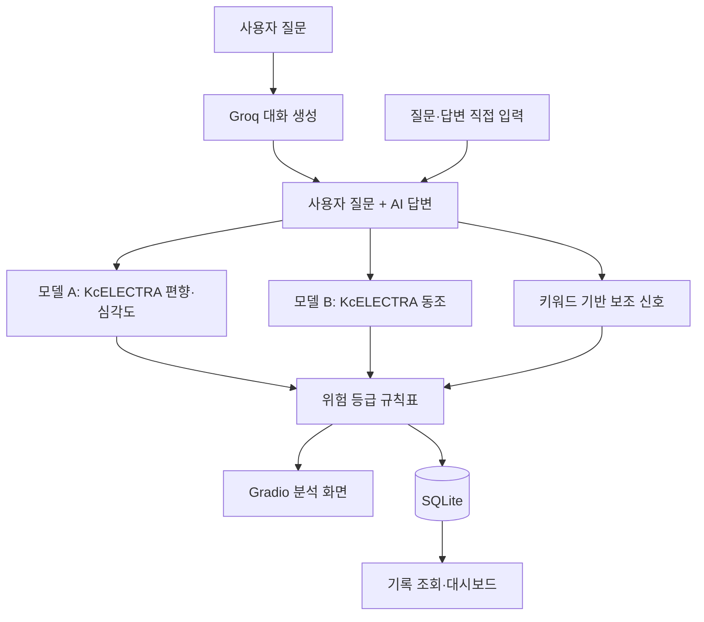

# VODA: AI Ethics Governance Platform

**한국어 AI 답변의 편향·혐오·욕설과 사용자 편향에 대한 동조를 분석하는 모니터링 프로토타입**

4인 팀 프로젝트 · Python · PyTorch · KcELECTRA · Hugging Face Transformers · Gradio · SQLite

VODA Sentinel은 사용자 질문과 AI 답변을 받아 위험 신호를 분류하고, 사람이 검토할 수 있도록 위험 등급과 분석 기록을 보여줍니다. 대화 생성 모델과 별도의 분류 모델을 연결한 교육·연구 프로젝트이며, 자동으로 윤리적 정답을 판정하거나 안전성을 보증하는 서비스는 아닙니다.

## 프로젝트에서 다룬 문제

AI는 사용자의 편향된 전제를 받아들이거나 강화하는 답변을 생성할 수 있습니다. 이 프로젝트는 생성 모델을 직접 재학습하는 대신, 생성된 답변을 별도 모델로 분석하고 관리자가 위험 신호를 확인하는 흐름을 구현했습니다.

핵심 질문은 두 가지입니다.

- **편향·혐오 탐지:** 문장에 집단을 겨냥한 혐오나 욕설 신호가 있는가?
- **동조 탐지:** AI가 사용자의 편향된 전제를 수용하거나 강화하는가?

공개 사전학습 모델과 공개 데이터를 활용했고, 팀은 프로젝트용 라벨 설계·데이터 가공·동조 데이터 구축·분류 모델 학습·대시보드 통합을 수행했습니다. KcELECTRA 자체를 처음부터 개발하거나 사전학습한 프로젝트는 아닙니다.

## 주요 기능

- 사용자 질문·AI 답변의 수동 입력 분석
- Groq API를 통한 대화 생성과 답변 분석
- 편향·심각도 모델과 동조 모델의 분리 추론
- 팀이 정의한 규칙표에 따른 A–F 위험 등급과 검토 안내
- SQLite 분석 기록 저장, 모니터링 목록 및 상세 화면
- Gradio와 HTML/CSS로 구현한 모바일 대응 UI

위험 등급은 프로젝트 내부 기준입니다. UI의 차단·필터링 문구는 권고이며, 실제 서비스의 자동 차단을 구현·검증했다는 의미는 아닙니다.

## 시스템 구조



최종 통합 노트북 v1.1은 **서로 다른 두 체크포인트**를 사용합니다. 모델 A의 편향·심각도 출력과 모델 B의 동조 출력을 조합합니다. 모델 B는 학습 시 동조·편향·심각도 세 헤드를 사용하지만, 앱의 최종 편향·심각도는 모델 A에서 가져옵니다.

성별·지역·종교 막대와 사용자 유도 신호는 **키워드 기반 보조 점수**이며, 학습된 카테고리 분류 확률이 아닙니다. 통합 앱은 두 모델 모두에 질문·답변을 결합해 입력합니다. 모델 A의 문장 단위 학습 데이터와 이 입력 형식의 차이는 평가상의 한계입니다.

## 데이터와 라벨 설계

### 모델 A: 공개 Unsmile 데이터 활용

[Smilegate AI의 Korean UnSmile](https://github.com/smilegate-ai/korean_unsmile_dataset)을 사용했습니다. 집단 혐오 카테고리와 욕설 신호를 조합해 프로젝트용 분류 라벨을 구성했습니다.

| 집단 혐오 신호 | 욕설 신호 | `bias_level`의 의미 | `severity` |
|---|---|---|---|
| 없음 | 없음 | 0: 정상 범주 | 0 |
| 없음 | 있음 | 1: 욕설만 | 1 |
| 있음 | 없음 | 2: 집단 혐오 신호만 | 1 |
| 있음 | 있음 | 3: 집단 혐오 + 욕설 | 2 |

집단 혐오 신호는 원본 8개 카테고리 라벨을 바탕으로 구성합니다. 이 라벨은 보편적인 윤리적 심각도의 연속 척도가 아니라 **프로젝트가 정의한 조합 범주**입니다. 보관 전처리 코드의 정상 범주는 원본 `clean` 조건도 확인합니다.

발표자료는 원본 욕설 라벨과 정규식을 함께 사용했다고 설명하지만, 보관 코드의 실제 대입은 정규식 결과만 사용합니다. 보관 CSV와 전처리 실행 출력의 전체 건수도 다릅니다. 이를 동일한 최종 파이프라인이라고 단정하지 않습니다. 자세한 대조 결과는 [자료 검증 메모](docs/evidence.md)에 기록했습니다.

### 모델 B: 자체 구성한 동조 데이터

동조 데이터는 공개 Unsmile과 별도로 구성했습니다. 보관된 라벨링 문서는 팀 원본과 Claude/Gemini 생성 예시를 활용했다고 설명합니다. 질문·답변 쌍에 동조 여부, 편향 표현 수준, 심각도를 부여했습니다.

두 모델의 `bias_level`과 `severity`는 의미와 매핑이 다릅니다. 모델 B의 심각도 매핑은 `{0:0, 1:0, 2:1, 3:2}`이며, 모델 A의 매핑과 혼용하지 않습니다.

데이터 원문·가공 CSV·Excel은 이 저장소에서 재배포하지 않습니다. 출처와 공개 범위는 [외부 자료 및 라이선스](THIRD_PARTY_NOTICES.md)를 참고하세요.

## 실험 결과와 해석

다음 수치는 **프로젝트 당시 발표·평가 자료에 기록된 결과**입니다. 저장소 정리 과정에서 모델을 다시 학습하거나 추론해 재현한 수치는 아닙니다.

| 실험 | 평가 규모 | 당시 기록 | 해석 범위 |
|---|---:|---|---|
| 모델 A v3 편향 분류 | 발표자료 기준 테스트 2,811건 | Accuracy 88.1%, Macro Recall 0.874, Macro F1 0.845 | 당시 보고값. 현재 테스트 CSV도 2,811건이지만 동일 실험의 데이터·체크포인트 조합은 확정하지 못함 |
| 모델 B 동조 분류 | 저장된 평가 출력 기준 85건 | Macro F1 1.0000 | 작은 내부 평가셋 결과. 문체 단서에 의존하는 지름길 학습 가능성 있음 |

현재 보관된 동조 CSV는 학습 678건·검증 84건·테스트 86건입니다. 85건 평가 기록과 버전이 일치하지 않아 하나의 실험으로 합쳐 소개하지 않습니다.

### 점수보다 중요했던 발견

1. **라벨이 무엇을 의미하는지 먼저 정해야 했습니다.** 초기 실험의 분류 기준과 클래스 불균형 문제를 분석하고, 집단 혐오와 욕설 신호를 구분하는 라벨 설계를 도입했습니다. 초기 모델과 v3는 라벨·평가 조건이 달라 정확도 차이를 동일 조건의 성능 향상으로 비교하지 않습니다.
2. **높은 점수만으로 문맥 이해를 입증할 수 없었습니다.** 발표자료는 동조 데이터의 답변 첫머리가 정답을 노출하는 문제를 지적합니다. 현재 보관 CSV에서도 `네,`, `네.`, `맞습니다`로 시작하는지를 보는 규칙이 검증 84건과 테스트 86건 모두에서 Macro F1 1.0을 기록했습니다. 이는 모델 자체의 재평가가 아니라 데이터 단서에 대한 별도 점검입니다.
3. **모니터링 UI까지 연결했습니다.** 모델 출력에 규칙 기반 등급과 기록 조회를 결합해 사람이 분석 결과를 확인할 수 있게 했습니다.

## 팀 구성과 기여

4명이 아래 역할을 분담했습니다. 저장소 소유자는 실명으로, 나머지 팀원은 A·B·C로 표기했습니다.

| 팀원 | 담당 역할 | 관련 산출물 |
|---|---|---|
| ilgyu Lee | 머신러닝 / 파인튜닝 | KcELECTRA 기반 분류 모델 파인튜닝 |
| A | 데이터셋 구축 | 데이터 확보, 동조 예시 구성, 라벨링 기준 |
| B | 대시보드 / 프론트엔드 | Gradio 화면, HTML/CSS, 분석 결과 표시 |
| C | 데이터 전처리 | 라벨 변환, 정제, 분할, CSV 생성 |

세부 코드의 공동 작성 범위는 이 표만으로 단정하지 않습니다. 저장소에 자료를 정리해 올린 사람과 모든 코드의 원 작성자는 동일하지 않을 수 있습니다.

### My Contribution — ilgyu Lee

머신러닝 역할을 맡아 공개 사전학습 모델인 KcELECTRA를 프로젝트의 분류 과제에 맞게 파인튜닝했습니다. 데이터셋 구축, 데이터 전처리, 대시보드 구현은 팀원들과 역할을 나눠 진행했습니다.

## 저장소 구성

```text
.
├── README.md
├── THIRD_PARTY_NOTICES.md
├── .gitignore
├── styles.css
├── notebooks/
│   ├── voda_dual_model_demo.ipynb
│   ├── unsmile_preprocessing.ipynb
│   ├── sycophancy_preprocessing.ipynb
│   └── sycophancy_training_evaluation.ipynb
└── docs/
    ├── evidence.md
    ├── reproduction.md
    └── source_inventory.md
```

노트북은 당시 구현을 보여주는 보관용 사본입니다. 출력·개인 경로·공유 링크·불필요한 메타데이터를 정리했으며, 모델 구조와 핵심 학습·추론 로직을 새로 구현하지 않았습니다. 원본 파일과의 대응은 [파일 목록](docs/source_inventory.md)에 기록했습니다.

## 실행 및 재현 범위

원래 실행 환경은 Google Colab GPU였습니다. 데모에는 두 개의 학습 체크포인트와 토크나이저, CSS, 대화 생성용 API 키가 필요합니다. **베이스 KcELECTRA만 다운로드해서는 팀의 분류 결과를 재현할 수 없습니다.**

데이터와 학습 가중치는 이 저장소에 포함하지 않습니다. 따라서 현재 공개본은 전체 실험을 바로 재실행할 수 있는 배포 패키지가 아닙니다. 보유 자료와 노트북 실행 순서, 경로 설정, 남아 있는 제약은 [재현 안내](docs/reproduction.md)를 참고하세요. 외부 API 호출에는 해당 서비스의 이용 조건과 비용이 적용됩니다.

## 출처와 이용 조건

- **KcELECTRA** — Junbum Lee / Beomi. [공식 저장소](https://github.com/Beomi/KcELECTRA), [모델 카드](https://huggingface.co/beomi/KcELECTRA-base), [MIT 라이선스](https://github.com/Beomi/KcELECTRA/blob/main/LICENSE).
- **Korean UnSmile** — Smilegate AI. [공식 저장소 및 인용 정보](https://github.com/smilegate-ai/korean_unsmile_dataset), [데이터 카드](https://huggingface.co/datasets/smilegate-ai/kor_unsmile). 데이터셋은 **CC BY-NC-ND 4.0**이며, 제공자의 소스코드·baseline 모델에 적용되는 Apache 2.0과 구분됩니다.
- **자체 동조 데이터** — 팀이 구성한 자료와 생성형 AI 보조 예시. 공개 데이터셋으로 소개하지 않으며 원문은 배포하지 않습니다.
- **발표자료** — 프로젝트 자료를 바탕으로 Claude의 도움을 받아 작성한 발표자료를 설명의 참고로 사용했습니다. 코드·평가 기록과 다른 부분은 구분해 정리했습니다.

원저작자와 제공 기관은 이 프로젝트를 후원하거나 결과를 보증하지 않습니다. 팀 코드 전체에 대한 별도의 오픈소스 라이선스는 아직 부여하지 않았으며, 외부 자료의 권리와 이용 조건은 각 원저작자에게 유지됩니다. 상세 공개 정책은 [THIRD_PARTY_NOTICES.md](THIRD_PARTY_NOTICES.md)에 있습니다.
