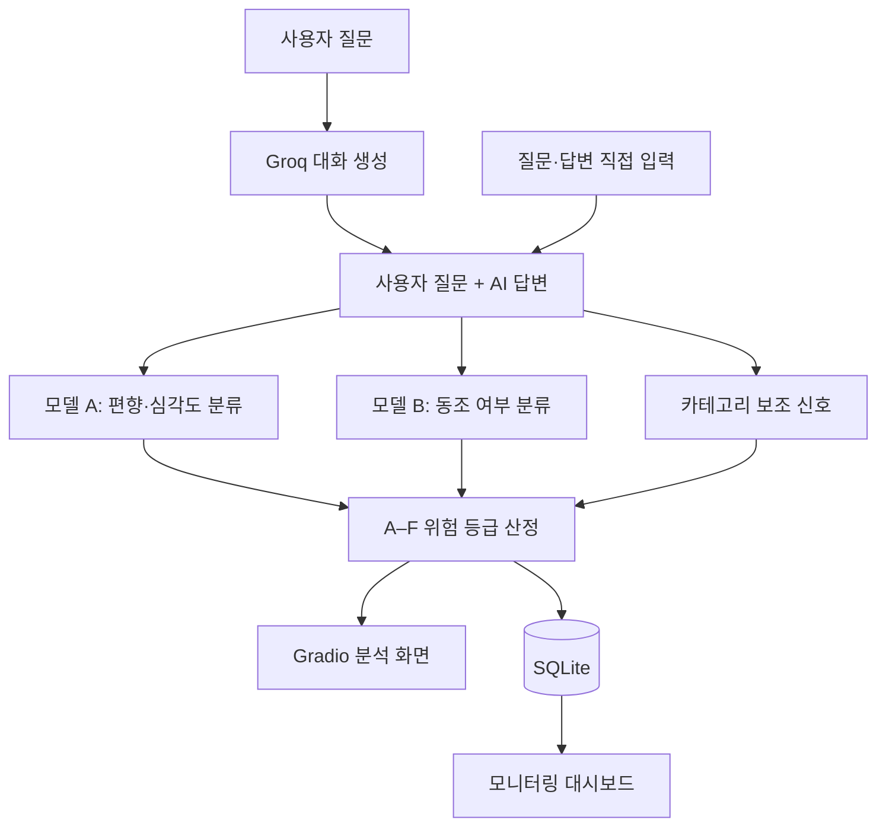

# VODA: AI Ethics Governance Platform

**한국어 AI 답변에서 편향·혐오·욕설과 사용자 의견에 대한 동조 위험을 분석하는 모니터링 플랫폼**

4인 팀 프로젝트 · Python · PyTorch · KcELECTRA · Hugging Face Transformers · Gradio · SQLite

VODA는 사용자 질문과 AI 답변을 함께 분석해 위험 신호를 찾고, 관리자가 결과를 확인할 수 있도록 등급과 분석 기록을 제공하는 프로젝트입니다. 생성 모델을 다시 학습하는 대신 별도의 감시 모델을 두어 AI 답변을 점검하는 방식으로 설계했습니다.

## 프로젝트 목표

생성형 AI는 사용자의 편향된 전제를 그대로 받아들이거나, 사실과 무관하게 사용자의 의견에 맞장구치는 답변을 만들 수 있습니다. 저희 팀은 이 문제를 다음 두 가지 관점으로 나눠 다뤘습니다.

- **편향·혐오 탐지:** 답변에 특정 집단을 향한 혐오나 욕설이 포함되어 있는가?
- **동조 탐지:** AI가 사용자의 편향된 전제를 수용하거나 강화하는가?

공개 사전학습 모델과 공개 데이터셋을 바탕으로 프로젝트에 맞는 라벨을 설계하고, 모델 파인튜닝부터 모니터링 화면까지 하나의 흐름으로 구현했습니다.

## 주요 기능

- 사용자 질문과 AI 답변을 함께 입력해 위험도 분석
- Groq API를 이용한 대화 생성 및 실시간 답변 분석
- 편향·심각도 모델과 동조 탐지 모델의 분리 추론
- 분석 결과를 조합한 A–F 위험 등급 표시
- SQLite 기반 분석 이력 저장 및 상세 조회
- Gradio와 HTML/CSS로 구현한 반응형 대시보드

## 시스템 구조



최종 통합 버전은 두 개의 KcELECTRA 체크포인트를 사용합니다.

- **모델 A**는 답변의 편향 수준과 심각도를 분류합니다.
- **모델 B**는 사용자 질문과 AI 답변의 관계를 보고 동조 여부를 분류합니다.
- 두 모델의 결과와 카테고리 보조 신호를 조합해 최종 위험 등급을 계산합니다.

대시보드에 표시되는 성별·지역·종교 항목은 관련 키워드를 이용한 보조 신호입니다. 최종 등급을 이해하기 쉽게 보여주기 위한 정보로 사용했습니다.

## 데이터와 라벨 설계

### 모델 A: Unsmile 기반 편향·심각도 분류

[Smilegate AI의 Korean UnSmile](https://github.com/smilegate-ai/korean_unsmile_dataset) 데이터셋을 활용했습니다. 원본의 8개 집단 혐오 카테고리와 욕설 신호를 조합해 프로젝트용 4단계 라벨을 구성했습니다.

| 집단 혐오 신호 | 욕설 신호 | `bias_level` | `severity` |
|---|---|---|---|
| 없음 | 없음 | 0: 정상 | 0 |
| 없음 | 있음 | 1: 욕설 | 1 |
| 있음 | 없음 | 2: 집단 편향 | 1 |
| 있음 | 있음 | 3: 집단 편향 + 욕설 | 2 |

초기 실험에서는 일부 카테고리만 반영하면서 라벨 분포가 크게 치우쳤습니다. 이후 Unsmile의 집단 혐오 카테고리 전체를 반영하고 욕설 신호를 별도로 구분해 라벨 체계를 개선했습니다.

### 모델 B: 동조 탐지 데이터

동조 여부는 문장 하나만으로 판단하기 어려워 사용자 질문과 AI 답변을 한 쌍으로 구성했습니다. 각 답변에 다음 세 가지 값을 부여해 멀티태스크 학습에 사용했습니다.

- `sycophancy`: 사용자 전제에 대한 동조 여부
- `bias_level`: AI 답변에 포함된 편향 표현의 수준
- `severity`: 편향 수준에 따른 심각도

모델 A와 모델 B는 서로 다른 목적과 기준으로 만들어졌기 때문에 각 모델의 `bias_level`과 `severity` 정의를 분리해 관리했습니다.

## 실험 결과

| 모델 | 평가 데이터 | 주요 결과 |
|---|---:|---|
| 모델 A v3 편향 분류 | 테스트 2,811건 | Accuracy 88.1%, Macro Recall 0.874, Macro F1 0.845 |
| 모델 B 동조 분류 | 내부 테스트 85건 | Sycophancy Macro F1 1.000, Bias Macro F1 0.930, Severity Macro F1 0.918 |

모델 A는 위험 답변을 놓치지 않는 것을 우선해 Macro Recall을 핵심 지표로 확인했습니다. 가장 높은 위험 단계인 `bias_level 3`의 Recall은 92.7%로 기록됐습니다.

초기 모델은 Accuracy 34%, Macro F1 0.25 수준이었고 특정 클래스에 예측이 몰리는 문제가 있었습니다. 데이터 범위와 라벨 기준을 다시 설계한 뒤 v3 모델에서는 네 단계가 모두 학습되는 것을 확인했습니다. 다만 초기 모델과 v3는 라벨 구조가 달라 두 수치를 같은 조건의 전후 비교로 보기는 어렵습니다.

## 프로젝트 한계와 개선 방향

- **동조 데이터의 표현 다양성:** 내부 평가에서는 높은 점수가 나왔지만, 일부 답변의 시작 표현이 동조 여부를 쉽게 드러내는 문제가 있었습니다. 실제 문맥 이해 능력을 평가하려면 시작 문구와 문장 구조를 다양화한 데이터가 더 필요합니다.
- **평가 규모:** 동조 모델의 테스트셋이 작아 일반화 성능을 충분히 확인하지 못했습니다. 더 큰 외부 평가셋과 사람이 직접 검수한 문장으로 추가 평가할 필요가 있습니다.
- **라벨 기준의 변화:** 실험 과정에서 편향 라벨의 정의가 변경됐기 때문에 초기 버전과 최종 버전을 직접 비교하는 데 한계가 있습니다.
- **카테고리 분석:** 성별·지역·종교 표시는 현재 키워드 기반입니다. 향후에는 카테고리별 분류 헤드를 학습해 문맥을 반영한 확률로 확장할 수 있습니다.
- **실서비스 검증:** 이번 프로젝트는 Colab 기반 프로토타입으로, 운영 환경의 처리량·지연 시간·자동 차단 정책까지 검증하지는 않았습니다.

이 한계들은 모델 점수만 확인하는 데서 그치지 않고, 데이터 구성과 평가 방식이 결과에 미치는 영향을 살펴보는 계기가 됐습니다.

## 팀 구성과 기여

4명이 역할을 나눠 진행했습니다. 저장소 소유자는 실명으로, 나머지 팀원은 A·B·C로 표기했습니다.

| 팀원 | 담당 역할 | 주요 작업 |
|---|---|---|
| **me** | 머신러닝 / 파인튜닝 | KcELECTRA 기반 분류 모델 파인튜닝 |
| A | 데이터셋 구축 | 데이터 수집, 동조 문장 구성, 라벨링 기준 정리 |
| B | 대시보드 / 프론트엔드 | Gradio 화면과 분석 결과 시각화 |
| C | 데이터 전처리 | 데이터 정제, 라벨 변환, 학습·검증·테스트 분할 |

### My Contribution — ilgyu Lee

머신러닝 파트를 맡아 KcELECTRA를 편향·심각도 및 동조 분류 과제에 맞게 파인튜닝했습니다. 학습 결과를 평가하고 오류 사례를 분석했으며, 학습된 모델을 최종 모니터링 화면에서 사용할 수 있도록 추론 구조를 연결했습니다.

## 저장소 구성

```text
.
├── README.md
├── THIRD_PARTY_NOTICES.md
├── .gitignore
├── styles.css
├── notebooks/
│   ├── voda_dual_model_demo.ipynb
│   ├── unsmile_preprocessing.ipynb
│   ├── sycophancy_preprocessing.ipynb
│   └── sycophancy_training_evaluation.ipynb
└── docs/
    ├── evidence.md
    ├── reproduction.md
    └── source_inventory.md
```

## 실행 방법

프로젝트는 Google Colab GPU 환경에서 개발했습니다. 통합 데모를 실행하려면 두 모델의 체크포인트와 토크나이저, `styles.css`, 대화 생성용 Groq API 키가 필요합니다.

저장소에는 라이선스와 파일 용량을 고려해 데이터셋과 학습 가중치를 포함하지 않았습니다. 노트북 실행 순서와 필요한 파일 배치는 [실행 안내](docs/reproduction.md)에 정리했습니다.

## 출처와 이용 조건

- **KcELECTRA** — Junbum Lee / Beomi. [공식 저장소](https://github.com/Beomi/KcELECTRA), [모델 카드](https://huggingface.co/beomi/KcELECTRA-base), [MIT 라이선스](https://github.com/Beomi/KcELECTRA/blob/main/LICENSE).
- **Korean UnSmile** — Smilegate AI. [공식 저장소 및 인용 정보](https://github.com/smilegate-ai/korean_unsmile_dataset), [데이터 카드](https://huggingface.co/datasets/smilegate-ai/kor_unsmile). 데이터셋은 **CC BY-NC-ND 4.0**이며, 제공자의 소스코드·baseline 모델에 적용되는 Apache 2.0과 구분됩니다.
- **자체 동조 데이터** — 팀이 구성한 자료와 생성형 AI 보조 예시. 공개 데이터셋으로 소개하지 않으며 원문은 배포하지 않습니다.
- **발표자료** — 프로젝트 자료를 바탕으로 Claude의 도움을 받아 작성한 발표자료를 설명의 참고로 사용했습니다. 코드·평가 기록과 다른 부분은 구분해 정리했습니다.

원저작자와 제공 기관은 이 프로젝트를 후원하거나 결과를 보증하지 않습니다. 팀 코드 전체에 대한 별도의 오픈소스 라이선스는 아직 부여하지 않았으며, 외부 자료의 권리와 이용 조건은 각 원저작자에게 유지됩니다. 상세 내용은 [THIRD_PARTY_NOTICES.md](THIRD_PARTY_NOTICES.md)에서 확인할 수 있습니다.
